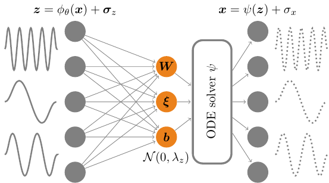
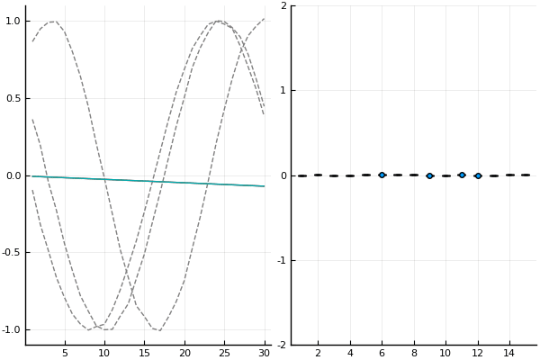
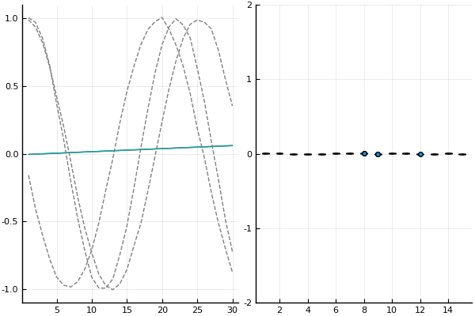

# Rodent seminar

The **R**elevant **o**rdinary differential equation i**dent**ifier (*Rodent*) is a
special kind of auto-encoder that enables the indentification of manifolds of
generating ODE models.

The figure below shows a schematic of the Rodent:

## Comparing Rodent and plain Auto-Encoders

The animations below show true data (dashed lines) and reconstructions (colored lines)
and the distributions of each latent variable for a batch of harmonic signals.
The Rodent needs a few more training iterations, but learns the simplest model for
harmonic signals with only four relevant parameters.

The Auto-Encoder converges faster but its latent space is very complex:

